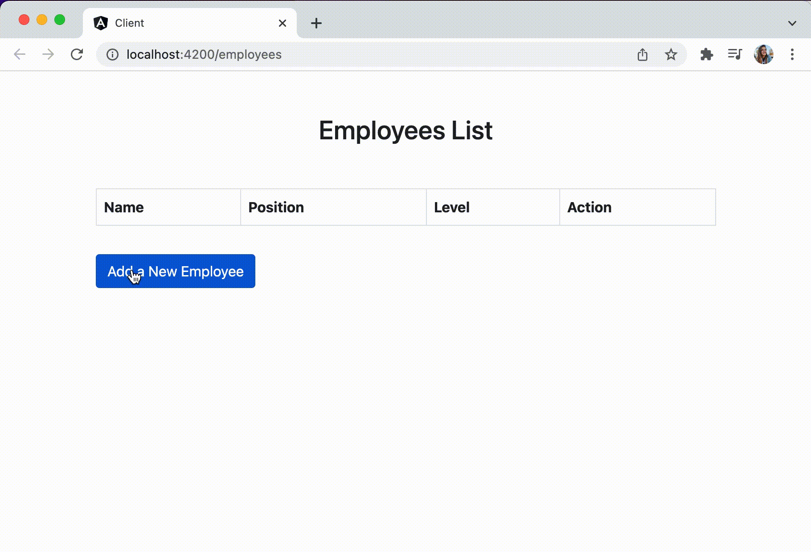

# What is the MEAN stack?
MEAN is a technology stack used for building full stack applications. It's a combination of the following technologies:

- MongoDB — document database
- Express — a Node.js framework for building APIs
- Angular — front-end application framework
- Node.js — server-side JavaScript runtime environment

Applications built with the MEAN stack follow the client-server architecture. The client, built with Angular, can be a web application, a native mobile application, or a desktop application. The client communicates with the server through an API, which is built with Express. The server then manages the requests with the MongoDB database.

This is build a RESTful API that implements the CRUD (Create, Read, Update, Delete) operations for an employee.
For data persistence, I used a MongoDB Atlas cluster.
And on the front end an employee management web application.

The interface will have the following pages:
- View all employees
- Add new employees
- Update existing employees



## How To Run

Set your [Atlas URI connection string](https://docs.atlas.mongodb.com/getting-started/) as a parameter in `server/.env`. Make sure you replace the username and password placeholders with your own credentials.

```
ATLAS_URI=mongodb+srv://<username>:<password>@sandbox.jadwj.mongodb.net/meanStackExample?retryWrites=true&w=majority
```

To start the server, go to the server folder and run:
```
npx ts-node src/server.ts
```
To instal Angular dependencies on client: go to the client folder and run:
```
npm install -g @angular/cli
```
To start the client: go to the client folder and run:
```
ng serve -o
```

When both applications are built and running, open your browser on http://localhost:4200/.

